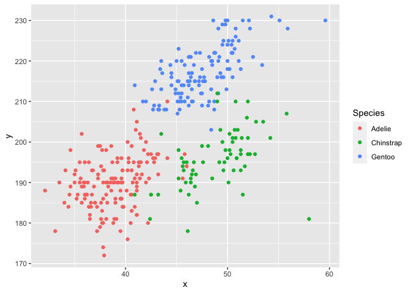

P8105 Homework 1
================
dxy2101
September 24th, 2022

This assignment focuses on getting started with R, best practices, and
working in Github.

``` r
library(tidyverse)
```

``` r
install.packages("palmerpenguins", repos = "http://cran.us.r-project.org")
```

    ## 
    ## The downloaded binary packages are in
    ##  /var/folders/1p/9yn7b9k529j149ntzd2ng2sw0000gn/T//RtmpVrcig8/downloaded_packages

# Problem 1

### Load and describe `penguins` dataset.

``` r
data("penguins", package = "palmerpenguins")

# List variables in dataset
names(penguins)
```

    ## [1] "species"           "island"            "bill_length_mm"   
    ## [4] "bill_depth_mm"     "flipper_length_mm" "body_mass_g"      
    ## [7] "sex"               "year"

The `penguins` dataset includes 8 variables describing a sample of 344
individual penguins. This dataset may be useful for understanding the
different compositions of different penguin species across
e.g. geographies, years, sex, and among the physical attributes
themselves.

The following variables are included:

- species
- island of origin
- bill length (mm)
- bill depth (mm)
- flipper length (mm)
- body mass (g)
- sex
- year data was collected

From `penguins`, we found that the mean flipper length, excluding
missing values, is 200.92 mm.

### Create scatterplot for flipper length and bill length

``` r
# Create a dataframe containing variables for the plot
plot_df = tibble(
  x = penguins$bill_length_mm,
  y = penguins$flipper_length_mm
)

# Create scatter plot with colors indicating species type
Species = penguins$species

ggplot(plot_df, aes(x=x, y=y, color=Species)) + geom_point()
```

<!-- -->

``` r
# Export scatter plot
ggsave("bill_flipper_plot.pdf", height = 4, width = 6)
```

# Problem 2

### Create a new data frame.

``` r
prob2_df = tibble(
  vec_numeric = rnorm(10), # random sample of 10 N(0,1)
  
  vec_logical = vec_numeric > 0, # indicate whether elements of sample > 0
  
  vec_character = c("How", "are", "you", "doing", "I", "hope", "you",
                    "are", "doing", "well"), # character vector of length 10
  
  vec_factor = factor(c("yellow", "red", "blue", "yellow", "red", "blue",
                        "yellow", "red", "blue", "yellow")) # factor with 3 levels + length 10
)
```

Try to take the mean of each variable.

``` r
mean(pull(prob2_df, vec_numeric)) # take mean of numeric vector
```

    ## [1] -0.3829125

``` r
mean(pull(prob2_df, vec_logical)) # take mean of logical vector
```

    ## [1] 0.4

``` r
mean(pull(prob2_df, vec_character)) # take mean of character vector
```

    ## Warning in mean.default(pull(prob2_df, vec_character)): argument is not numeric
    ## or logical: returning NA

    ## [1] NA

``` r
mean(pull(prob2_df, vec_factor)) # take mean of factor vector
```

    ## Warning in mean.default(pull(prob2_df, vec_factor)): argument is not numeric or
    ## logical: returning NA

    ## [1] NA

Taking the mean of `vec_numeric` and `vec_logical` returned a value.
Taking the mean of `vec_character` and `vec_factor` is non-applicable.

### Convert all variables to numeric.

``` r
as.numeric(pull(prob2_df, vec_logical)) # convert vec_logical to numeric
as.numeric(pull(prob2_df, vec_character)) # convert vec_character to numeric
as.numeric(pull(prob2_df, vec_factor)) # convert vec_factor to numeric
```

Converting `vec_logical` to numeric resulted in a binary numeric output
(i.e. 1, 0). 1 indicating TRUE and 0 indicating FALSE. Converting
`vec_character` to numeric resulted in outputs that were also listed as
NA. Converting `vec_factor`to numeric resulted in three types of numeric
outputs (i.e. 1, 2, 3) to match the three different levels.

The binary nature of `vec_logical` explains the numeric output after
taking its mean before converting it to numeric. This is built into R.
However, the same could not happen for `vec_factor`.
